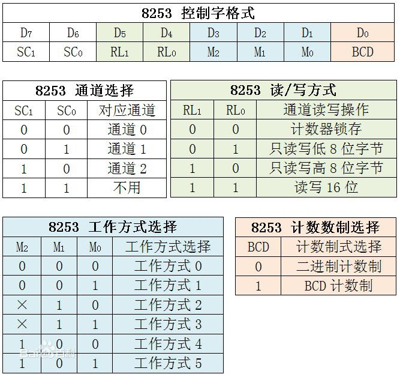

参考自[CSDN博客_Mr.Phoebe](http://blog.csdn.net/u013007900/article/details/50408903)
1. 8253芯片是可编程计数器/计时器(Counter/Timer)。因为计时和计数的本质是相同的，所以即可以叫计时器也可以叫计数器。
2. 内部有三个完全相同的计数器，分别是计数器0，计数器1,计数器2.
3. 端口号由引脚A1和A0确定。如果计数器0端口号为0x40，则计数器1为0x41,计数器2为0x42,控制端口为0x43。
4. 8253编程的两条原则：  
  * 必须先将控制字写入控制寄存器，即0x43端口。
  * 其次向计时器写入初值，初值必须符合控制字的规定。
5. 控制字有8位，只能写入，不能读出。

| D7  | D6  | D5  | D4  | D3 | D2 | D1 | D0  |
| --- | --- | --- | --- | -- | -- | -- | --- |
| SC1 | SC0 | RW1 | RW0 | M2 | M1 | M0 | BCD |
  * D0：计数码选择。决定计数器在减1过程中采用的进位制，0表示二进制，1表示BCD计数制。
  * D3D2D1：工作方式选择。
    * 000:Interrupt on Terminal Count(计数结束产生中断)
    * 001:Hardware Retriggerable one-shot(可编程单稳态触发器)
    * 010:Rate Generator(分频器)
    * 011:Square Ware Mode(方波发生器)
    * 100:Software Triggered Strobe(软件触发选通脉冲)
    * 101:Hardware Triggered Strobe(硬件触发选通脉冲)
  * D5D4:读写格式控制。01,只读写低8位。10,只读写高8位。11,先读写低8位，后读写高8位。00,把当前计数值存入输出锁存器，供以后读取。
  * D7D6：计数器选择。00,选择计数器0。01,选择计数器1。10,选择计数器2。11,在8253中为非法编码，在8254中用于读回命令。

