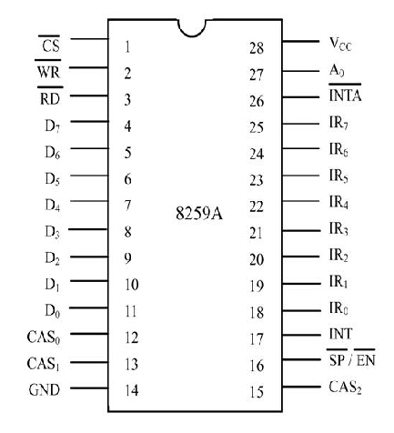
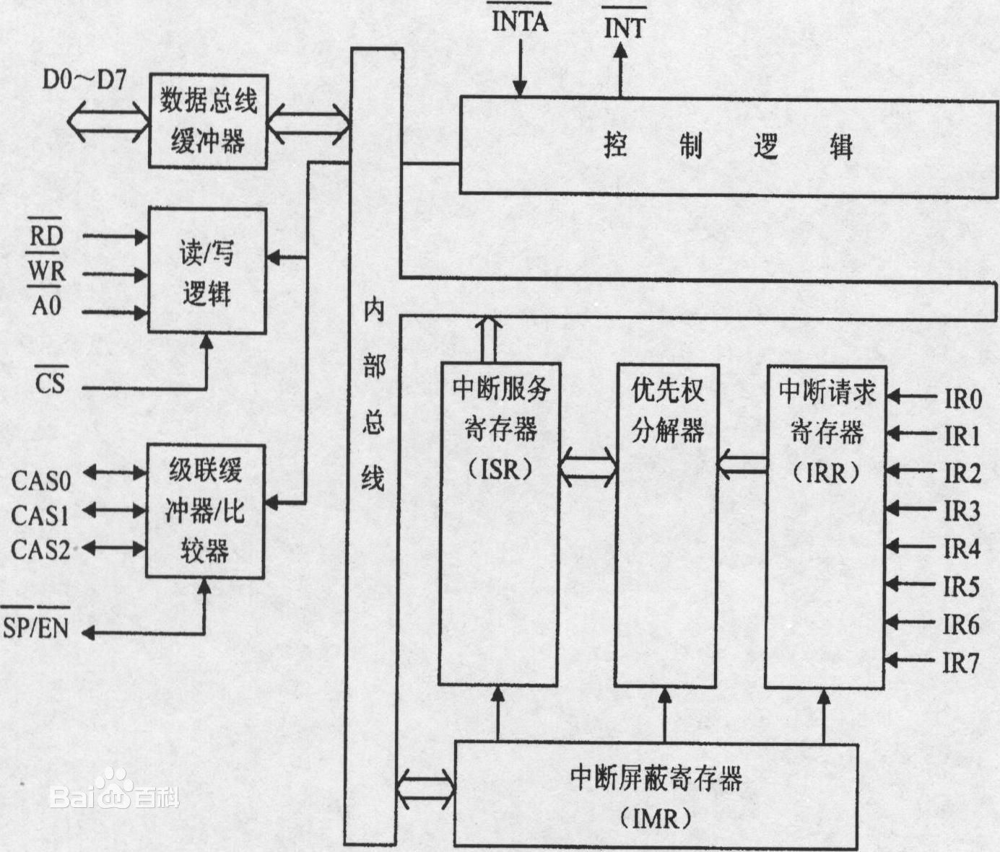
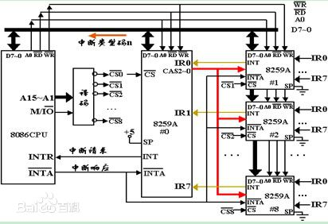
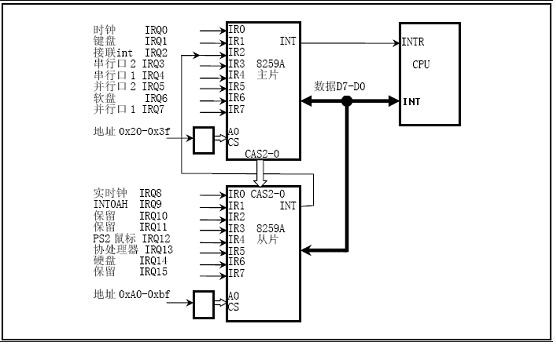

#### 中断概述

中断是由硬件设备产生的电信号，它首先被中断控制器处理，中断控制器再把与它唯一对应的数据发送到处理器的数据总线。之所以要唯一对应，是因为处理器只有1个输入来接收设备中断，它没法分清是哪个设备需要服务。英特尔32位处理器一般有2个中断控制器，每个中断控制器可以处理8个输入，由于一个从控制器的输出连到主控制器的输入，所以2个中断控制器组合起来一共可以处理15个外设的中断。中断控制器里的0号插座是专有的，只能接时钟输入；其它插座则可以接任意设备。

主中断控制器的INT引脚连接CPU的INT引脚，从中断控制器的INT引脚则连到主中断控制器的输入插座上。中断控制器就是通过这个INT引脚告诉CPU中断来了。CPU的INTA引脚和中断控制器的INTA引脚相连，它通过向中断控制器的INTA引脚发信号使得中断控制器把数据发到系统数据总线上，这样处理器就知道该执行哪个服务例程了。

##### CPU如何处理中断

当一个进行着的进程收到中断时，处理器会为中断服务设置一个新栈。这个栈的位置由**任务状态段**（TSS)里的一个入口决定。处理器会自动把若干重要的寄存器压到这个栈上，包括恢复被中断进程自已的栈和程序计数器所必须的那些寄存器。

当从中断返回被中断的进程时，会执行`iretd`指令。`iretd`恢复中断前的状态，恢复被硬件压入的寄存器，并切换回中断发生之前的栈。

当CPU收到一个中断后，会关闭所有的中断。这样就可以保证进程的栈桢不会溢出。当进程表之外的内核栈被使用时，中断始终处于关闭的状态。当内核栈被使用时，也有机制可以保证异常处理例程可以运行。可以把异常理解为不能关闭的中断。当异常发生时，CPU把必要的寄存器压入当前的栈里。当内核运行时不应发生异常，否则将产生panic。

`iretd`返回内核进程和返回用户进程的机制是类似的，处理器通过检查代码段选择器来决定如何处理`iretd`。

#### 8259A概述

8259A芯片是一个中断管理芯片，中断的来源除了来自于硬件自身的NMI中断和来自于软件的`INT n`指令造成的软件中断之外，还有来自于外部硬件设备的中断，这些中断是可屏蔽的。这些中断也都通过**PIC**(Programmable Interrupt Controller)进行控制，并传递给CPU。

一个8259A芯片的可以接最多8个中断源，但由于可以将2个或多个8259A芯片级连（cascade），并且最多可以级连到9个，所以最多可以接64个中断源。如今绝大多数的PC都拥有两个8259A，这样 最多可以接收15个中断源。

8259提供了两种屏蔽方式：1,简单方式，提供8位屏蔽字对应各个IR。2,特殊方式，允许CPU让低优先级的外设去中断高优先级的服务程序。

8259芯片里保存了一个表，这个表会生成一个8位的索引，CPU使用它来为每个可能的中断输入找到正确的中断门描述符。这个表是由BIOS初始化的。当使用了中断的驱动程序启动的时候，可以根据需要进行修改。驱动程序可以请求对相应的位进行重置来开启它需要的中断。

#### 内部结构

- IRR:中断请求寄存器8位，IR0～IR7每一位对应一个设备，共可接收8个设备的中断请求。
- IMR:中断屏蔽寄存器为8位，设置需要屏蔽的中断请求
- ISR：中断服务寄存器为8位，保存当前正在处理的中断请求
- PR：优先权判别器。当多个中断同时发生时，将高优先级者优先传递给CPU。优先级选择方式有4种：1,完全嵌套方式，优先级从IR0到IR7依次降低。2,轮换方式A，一个中断完成后立即把它放到最低优先级的位置上。3,轮换方式B，CPU可以在任何时间规定最优优先级。4,查询方式，CPU访问中断状态寄存器。
- 控制逻辑：向CPU发出中断请求信号INT，并接受CPU的中断响应信号INTA。
- 数据总线缓冲器：保存数据总线的数据，传输命令控制字、状态字和中断类型码。
- 读/写逻辑：确定数据总线缓冲器中数据的传输方向，选择内部的各命令字寄存器。RD为读，WR为写，AO为I/O端口识别，CS为设备选择。
- 级联缓冲/比较器：主从控制器的级联是由级联总线CAS0，CAS1，CAS2实现的。

#### 工作原理

#### 实例：两个中断控制器连接

​     	Master 8259A:   
​		0x20: ICW1,OCW2,OCW3,IRR,ISR  
​		0x21: ICW2,ICW3,ICW4,IMR, address registers  
​	Slave 8259A:   
​		0xA0: ICW1,OCW2,OCW3,IRR,ISR  
​		0xA1: ICW2,ICW3,ICW4,IMR, address registers