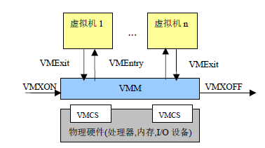
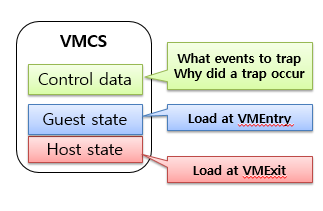

#### 简介

Intel的虚拟化技术包含了三方面的虚拟化：**CPU虚拟化**是VT-x或VT-i，**内存虚拟化**是EPT(Extended Page Table)，**I/O虚拟化**是VT-d(Intel Virtualization Technology for Directed I/O)。

VT-x是Intel虚拟化技术的指令集，在x86平台上的VT技术被称为VT-x（在itanium平台上的VT技术被称为VT-i）。

它引入了VMX操作模式，有两种VMX操作模式：**VMX root operation**是为VMM/Hypervisor使用的，其行为与传统的IA32一样；**VMX not-root operation**则是为Guest使用的，是在VMM控制下的IA32环境。Guest是运行在Ring0下的，Guest运行的指令一般可以直接控制硬件，只有需要执行特殊指令才会切换到VMM。

VMX操作流程：

1. 执行`vmxon`指令进入VMX操作模式。
2. 执行`vmlaunch`或`vmresume`指令产生VMEntry操作，进入到Guest OS。
3. Guest OS执行特权指令导致VMExit操作，陷入到VMM。
4. VMM可以通过`vmxoff`指令退出VMX操作。

VT-x设计了一个Virtual-Machine Control Structure(VMCS)的数据结构，CPU在发生VMEntry或VMExit时都会查询和更新VMCS。

- 0～3字节，VMCS版本标识
- 4～7字节，VMX中止的原因
- 8字节～end，数据区。由3个部分组成：控制区域(虚拟执行控制域，VMExit控制域，VMEntry控制域，VMExit信息域)，Guest区(寄存器状态，非寄存器状态)，Host区(主要是VMM运行时的状态)。

[Intel Virtualization Technology for Directed I/O: Architecture Specification](https://software.intel.com/sites/default/files/managed/c5/15/vt-directed-io-spec.pdf)