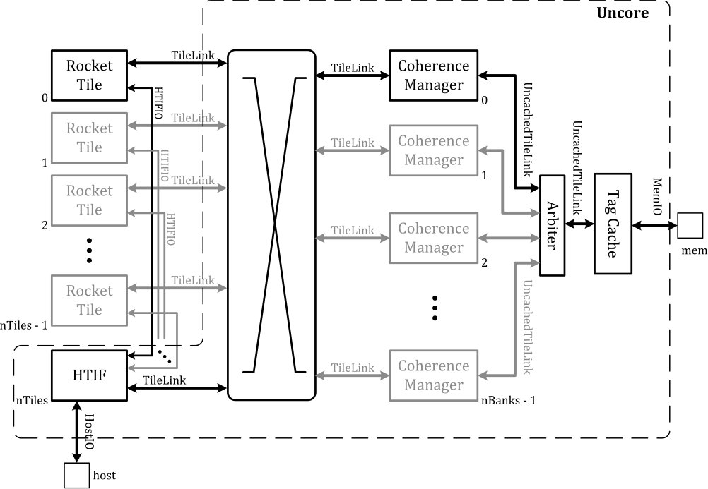

#### 概览

下图是对Rocket_chip的概览。

- Rocket Tile：一个Rocket core和对应的L1缓存。
- htif：Host/Target interface，Host指ARM PS，Target指RISC-V。
- coherence manager：一致性管理器，管理L1缓存和L2缓存的一致性。
- TileLink：Rocet Tile与一致性管理器之间的通信协议。