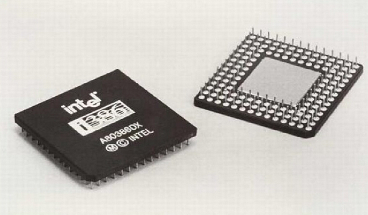
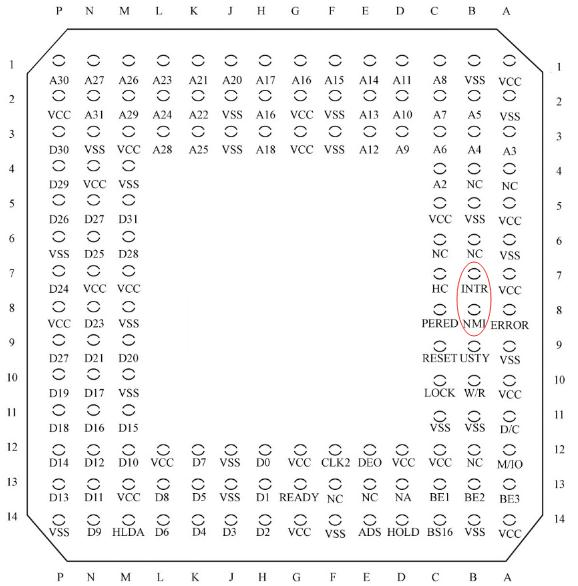

- CPU(中央处理单元,或处理器)其实只是在执行一个非常简单的循环:从一个被称为『程序计数器』的寄存器中获取一个内存地址,从个地址读出机器指令,增加程序计数器的值,执行机器指令,不断反复。

- 速度最快的数据存储器是处理器的寄存器组。

  | X86寄存器类型 | 数量    | 寄存器名称                                  |
  | ------------- | ------- | ------------------------------------------- |
  | 通用寄存器    | 8(32位) | %eax,%ebx,%ecx,%edx,%edi,%esi,%ebp,	%esp |
  | 程序计数器    | 1(32位) | %eip(instruction pointer)                   |
  | 浮点寄存器    | 8(80位) | 名称未知                                    |
  | 控制寄存器    | 4       | %cr0,%cr2,%cr3,%cr4                         |
  | 调试寄存器    | 4       | %dr0,%dr1,%dr2,%dr3                         |
  | 段寄存器      | 6       | %cs,%ds,%es,%fs,	%gs,%ss                 |
  | 伪寄存器      | 2       | %gdtr,%ldtr                                 |

- 缓存是主存和寄存器在速度和大小上的折衷。

- 80386CPU

  

- 80386引脚

  