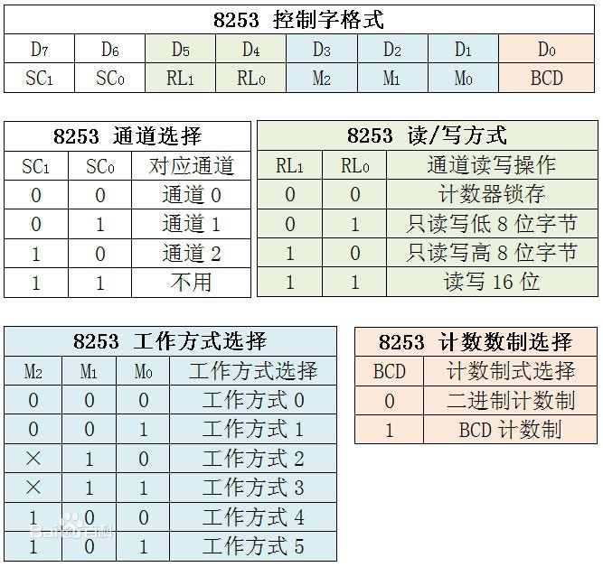

#### 参考资料

- [CSDN博客_Mr.Phoebe](http://blog.csdn.net/u013007900/article/details/50408903)
- 《操作系统的设计与实现》

#### 概述

计时器，也叫时钟，必须有它才能进行分时系统（timesharing system ）的操作。

在计算机里使用了两种时钟，和人们通常使用的钟表有很大的不同。

第一种已经在现代PC里灭绝了。它直接使用的220V或110V交流电的频率，大概50~60Hz产生一个中断。

第二种是可编程时钟。它由三部分组成：晶体振荡器，计数器和保持寄存器。晶体振荡器就是一块被精确切割的石英晶体，加上电压后它就会产生极为精确的周期性信号，频率一般在5~200 MHz。计数器里的值随着这个周期性信号递减，保持寄存器用于记录计数器的值。当计数器到0之后，就会触发CPU中断。计算机里高于200MHz的频率一般是通过分频电路实现的。

可编程时钟的模式：

- 单次模式(one-shot mode)

  当时钟启动，它先把保持寄存器的值复制到计数器，然后计数器的值开始递减。当计数器的值为0则产生一个中断然后时钟停止。直到有软件显式地启动时钟它才再次进行上述流程。

- 方波模式(square-wave mode)

  相较于单次模式，当计数器为0产生中断后，自动把保持寄存器的值复制到计数器，这样整个流程就可以独立地重复下去。这些周期性的中断就叫**时钟滴嗒**(clock ticks)。

可编程时钟的的优势就是可以通过软件控制中断的频率。可编程时钟芯片里通常包含2~3个独立的可编程时钟，这些时钟还有其它的选项（比如：用计数递增取代递减，屏蔽中断等）。

当计算机关机后，会使用由电池驱动的备份时钟来防止时间丢失。如果没有备份时钟，软件也可能向用户询问当前时间。联网的系统还可以从远程主机上获取当前时间。最终，时间都被转换为UTC。然后，运行的系统就给时钟滴嗒计数，每过一秒就给真实时间加一。关于系统时钟和备份时钟同步的问题，一般是通过应用程序来手动设置的。

除了最早期的IBM PC，所有的计算机都有独立的时钟电路来为CPU、内部数据总线和其它部件提供timing siganls。这个时钟提供了人们所说的CPU时钟速度。

#### 8253芯片

1. 8253芯片是可编程计数器/计时器(Counter/Timer)。因为计时和计数的本质是相同的，所以即可以叫计时器也可以叫计数器。
2. 内部有三个完全相同的计数器，分别是计数器0，计数器1,计数器2.
3. 端口号由引脚A1和A0确定。如果计数器0端口号为0x40，则计数器1为0x41,计数器2为0x42,控制端口为0x43。
4. 8253编程的两条原则：  
  * 必须先将控制字写入控制寄存器，即0x43端口。
  * 其次向计时器写入初值，初值必须符合控制字的规定。
5. 控制字有8位，只能写入，不能读出。

| D7  | D6  | D5  | D4  | D3 | D2 | D1 | D0  |
| --- | --- | --- | --- | -- | -- | -- | --- |
| SC1 | SC0 | RW1 | RW0 | M2 | M1 | M0 | BCD |
  * D0：计数码选择。决定计数器在减1过程中采用的进位制，0表示二进制，1表示BCD计数制。
  * D3D2D1：工作方式选择。
    * 000:Interrupt on Terminal Count(计数结束产生中断)
    * 001:Hardware Retriggerable one-shot(可编程单稳态触发器)
    * 010:Rate Generator(分频器)
    * 011:Square Ware Mode(方波发生器)
    * 100:Software Triggered Strobe(软件触发选通脉冲)
    * 101:Hardware Triggered Strobe(硬件触发选通脉冲)
  * D5D4:读写格式控制。01,只读写低8位。10,只读写高8位。11,先读写低8位，后读写高8位。00,把当前计数值存入输出锁存器，供以后读取。
  * D7D6：计数器选择。00,选择计数器0。01,选择计数器1。10,选择计数器2。11,在8253中为非法编码，在8254中用于读回命令。

