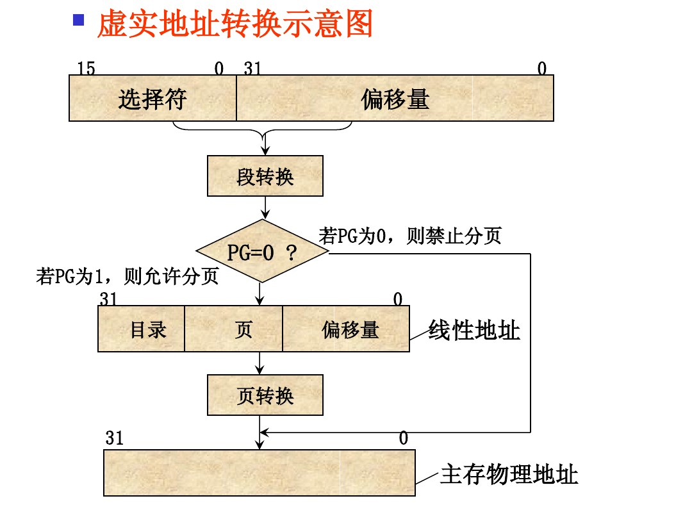

## 资源

本文是对Intel手册的总结，但要注意在gcc下的汇编是使用的是gas syntax。

## 一、应用程序编程

### 1. 基本编程模型

#### 1.1 寄存器

- 通用寄存器(8个)：

  EAX，EBX，ECX，EDX，EBP，ESP，EBI，EDI

- 段寄存器(6个)：

  CS: DS: ES:SS: FS: GS: 

- 标志寄存器：EFLAGS，低16位叫FLAGS，FLAGS是为8086和80286模式准备的。标志可以分为三种：状态标志，控制标志和系统标志

  

- 寄存器与内存的对应关系


### 

### 2. 应用程序指令集

#### 2.0 AT&T汇编语法
* (%eax)	//代表eax指向的内存地址
   1(%eax)	//指向eax指向的内存地址的下一个字节的地址
* 赋值方向是从左向右(Intel语法的赋值方向是从右向左)
#### 2.1  数据传送指令

- MOV：movq(moves a quadword from source to destination, in x86 a word is 16 bits), movl(moves a long from source to destination, long is 32 bits)
- XCHG：(Exchange)交换两个操作数的内容。这两个操作数可以都是寄存器，也可以一个寄存器一个内存。当有一个操作数是内存时，LOCK信号会自动激活。
- stos：将EAX的值保存到ES:DSI指向的字符串中。

#### 2.2  二进制运算指令  
  * bt  %1,%2	//bit test  
  	 bts %1,%2	//把%2对应地址的%1位填入CF位，然后把%2对应地址的%1位置1(bit test and set)  
  	 btr %1,%2	//把%2对应地址的%1位填入CF位，然后把%2对应地址的%1位置0(bit test and reset)
  	 btc %1,%2	//把%2对应地址的%1位填入CF位，然后把%2对应地址的%1位反转(bit test and complement)
#### 2.3 十进制运算指令
#### 2.4 逻辑运算指令
#### 2.5 控制转移指令 
##### rep
  - repne: zf=0且cx>0，则重复
  * repe: zf=1且cx>0,则重复
  * rep: cx>0,则重复
#####  iret
iret指令的执行过程（iret指令用于从int指令返回）

  1. 从内核栈出弹出相应寄存器的值
  2. 如果存在特权级转换，则会从内核栈中弹出用户态栈的ss:esp
  3. 如果有错误码，需要软件完成错误码弹出的功能

##### int
  - int指令的执行过程
    1. 从IDT中获得描述符
    2. 检查%cs的域CPL <= 描述符记录的特权级DPL(这使得内核可以禁止一些特权级系统调用). 如果目标段选择符的PL<CPL(即发生了特权级转换),就在CPU内部的寄存器中保存%esp和%ss的值。
    4. 从一个任务段描述符中加载%ss和%esp。(不能使用用户栈来保存值，因为用户可能还没有建立合适的栈，所以使用任务段中指定的栈，这个栈是在内核模式中建立的)
    5. 将%ss压栈。
    6. 将%esp压栈。
    7. 将%eflags压栈。
    8. 将%cs压栈。
    9. 将%eip压栈。
    10. 清除%eflags的一些位。
    11. 设置%cs和%eip为描述符中的值。
  * INT指令通过软件方法调用中断处理程序，立即数(0~255)是IDT中要调用的中断例程的索引号。在保护模式下，IDT是8字节描述符的数组，描述符必须指明是中断、陷阱还是任务门。在实模式下，IDT是4字节大小的指针的数组。不管是实模式还是保护模式，IDT的基址的线性地址都由IDTR保存。

  * INTO指令与INT指令相同，只是它的立即数被隐式地指定为4,此中断只有在溢出标志位设置为1时才使用。

  * INT指令表现的像是远程调用(far call)，只是在压入返回地址之前，标志寄存器也会被压入栈中。中断例程通过IRET指令返回，IRET指令会把栈里的标志寄存器和返回地址弹出。

  * 在实模式下，INT指令会依次将标志寄存器，CS寄存器，返回地址压入栈中，然后跳转到由中断号指定的长地址处。
#### 2.6 串与字符转移指令  
  * ins:串输入指令
    *	edx存放接口，edi存放内存指针
    		insl:将edx指向的接口的数据放到edi指向的内存中
#### 2.7 块结构语言的操作指令
#### 2.8 标志控制指令  
  * cld:将标志寄存器flag的DF位（方向标志位）清零，使变址寄存器SI,DI自动增1
  * std：将DF位置1,使SI，DI自动减1
#### 2.9 协处理器接口指令
#### 2.10 段寄存器指令
  * pushal 将所有通用寄存器的内容压入栈中，入栈顺序eax,ecx,edx,ebx,esp,ebp,esi,edi
#### 2.11 其它指令  
  * invlpg m  // 清空TLB
  * SGDT/SIDT 将描述符表寄存器中的内容复制到由操作数定义的6字节的内存中。寄存器的LIMIT域赋值给有效地址的第一个字中。如果操作数是32位的，则接下来的3个字节由寄存器的BASE域赋值，第4个字节会写入0，（因为）最后一个字节未定义。否则，如果操作数是16位的，接下来的4个字节由寄存器的32位BASE域赋值。
## 二、系统编程

### 1. 系统架构

### 2. 内存管理


### 3. 保护模式

保护模式提供了虚拟内存管理。

#### 3.1 寄存器


* 保护模式下新增的寄存器：

  * GDTR全局描述符表寄存器(48位=32位基址+16位限长)

  * LDTR局部描述符表寄存器

  * TR任务寄存器

    TR用于任务切换，存放了一个16位的选择符用以指示GDT中任务状态段描述符(TSS)的位置。TSS描述符定义了任务状态段的起始地址和大小。每个任务都有自己的TSS，存放进程运行时所需的硬件上下文。

  * CR0～CR3四个控制寄存器

    | 寄存器名 | 意义                                                         |
    | -------- | ------------------------------------------------------------ |
    | CR3      | page directory base register(PDBR), store phisical address of the current page directory. |
    | CR2      | 导致页错误的线性地址                                         |
    | CR1      | 保留不用                                                     |
    | CR0      | 控制协处理器和保护控制                                       |

    | CR0的位 | 意义                                                         |
    | ------- | ------------------------------------------------------------ |
    | PG      | 1开启分页，0关闭分页。                                       |
    | PE      | 1开启保护模式，0处于实模式。注：进入保护模式后就无法再回到实模式。 |
    | MP      | 1系统中存在一个数学协处理器，0系统中不存在数学协处理器。     |
    | EM      | 1系统使用软件模拟器执行数学运算。                            |
    | R       | 1表示安装的是80387数学协处理器。                             |
    | TS      | 任务切换位，由处理器自动设置，也可由软件清零。               |

  * EIP的长度扩展到32位

  * EFLAGS有32位，比实模式下的16位FLAGS新增了5个位。**IOPL**输入输出特权级占2位，指示执行IO操作时需要的特权级。**NT**嵌套任务标志，指明当前任务是否嵌套，由硬件自动设置，用软件清零。**RF**为恢复标志。**VM**为虚拟8086标志。

  * CS，DS，ES，SS，FS，GS功能改变

    实模式下的段寄存器在保护模式下被称为段选择符寄存器，里面存放的值不再是段基址而是段选择符。选择符用来选择位于GDT或LDT中的一个段描述符。段选择符格式如下：

    | 15～3 | 2                      | 1～0            |
    | ----- | ---------------------- | --------------- |
    | index | TI(1访问GDT，0访问LDT) | RPL(请求特权级) |

* 全局描述符表GDT

  GDT中放的是段描述符，每个段描述符占8个字节。GDT最大尺寸为0x10000个字节，最多可放0x2000个表。

* 局部描述符表LDT

  LDT中放的是段描述符。

#### 3.2 段描述符

段描述符格式如下：

| 字节 |          意义          |
| :--: | :--------------------: |
|  7   |      段基址31~24       |
|  6   | G+X+O+AVL+段限长19～16 |
|  5   |     P+DPL+S+类型+A     |
|  4   |      段基址23~16       |
|  3   |       段基址15~8       |
|  2   |       段基址7~0        |
|  1   |       段限长15~8       |
|  0   |       段限长7~0        |

- 第6个字节说明了描述符的属性
  - G: GRANULARITY，1段长度以页(4K)为单位，0段长度以字节为单位。
  - X：1该段为32位代码段，0该段为16位代码段。
  - AVL: AVAILABLE FOR USE BY SYSTEMS PROGRAMMERS。
- 第5个字节说明了描述符的访问权限
  - P: SEGMENT PRESENT，1段不在内存中，0段在内存中
  - DPL: DESCRIPTOR PRIVILEGE LEVEL，描述符特权级
  - S: 代码段或数据段描述符，0系统段或门描述符
  - A: ACCESSED，1访问过，0未访问过

#### 3.3 地址映射

1. 寻址与内存保护

   

2. 虚拟地址转换过程



#### 3.4 保护机制

四种特权级如下所示，大多数操作系统只用0和3两个特权级：

| 编号   | 特权级   |
| ------ | -------- |
| ring 0 | 内核     |
| ring 1 | 系统调用 |
| ring 2 | 共享库   |
| ring 3 | 应用程序 |

在硬件支持下，通过软件对存储器访问进行检查和限制的防护措施称为**保护**。

- 保护性检查

  保护性检查是由MMU硬件完成的，检查项目如下：

  - 类型检查：检查存放段选择符的段寄存器与要访问的段描述符类型是否一致。
  - 限长检查：检查虚拟地址是否在段限长之内，以确保该段的访问没有越界。
  - 指令集的限制：有16条指令只能在特权级为0的代码段中执行。
  - I/O限制：I/O指令只能在小于等于IOPL的特权级上执行。
  - LDT的限制：每个任务的LDT都只能自己使用而拒绝其它任务使用。
  - 越级调用限制：CALL选择符-->门描述符-->段描述符

- 越级访问代码段和数据段

  若要从低特权级访问高特权级内存段中的的代码和数据，需要使用门描述符。


### 4. 多任务

80386没有为多任务处理添加新的特殊指令，而是使用了特殊的数据结构。支持多任务处理的数据结构和寄存器是：任务状态段(Task state segment)，任务状态段描述符(Task state segment descriptor)，任务寄存器(Task register)，任务门描述符(Task gate descriptor)。

### 5. 输入输出

#### 5.1 I/O地址映射

- 80386允许两种方式的I/O：I/O地址空间(使用特殊I/O指令)，I/O内存映射(无需特殊指令)

- I/O地址空间

  

  - I/O地址空间的0页(0000H~00FFH)是主板上I/O芯片的接口地址，共计256字节的寻址区。这些芯片是计时器/计数器、中断控制器、DMA控制器、并行接口和键盘控制器。
  - 其它的I/O地址空间(0100H~FFFFH)用于主板扩展槽上的接口控制卡(也叫适配器)。如图形适配器、声卡、网卡等。

### 6. 异常与中断 

中断来自于CPU外部的异步事件，而异常来自于CPU自身在指令执行过程中检测到的条件。

- 有两种中断：可屏蔽，不可屏蔽。
- 有两种异常：由处理器检测的(包括faults, traps, aborts)，可编程的(指令INTO, INT 3, INT n, BOUND都能触发异常，这些异常也被叫做“软件中断”，但处理器也把它们作为异常来处理)。

#### 6.1 未定义


#### 6.2 IDT与IDTR

- IDTR中断描述符表寄存器(48位=32位基址+16位限长)

  	LIDT指令：将内存中IDT长度及起始地址加载到IDTR
  	SIDT指令：将IDTR的内容加载到内存中

- 中断描述符表IDT

  IDT中放的是中断门描述符(即中断处理程序的入口)，IDT中有256个门描述符，每个门描述符占8个字节。

  有4种类型的门描述符如下表所示：

  | 门描述符类型   | 作用                                       |
  | -------------- | ------------------------------------------ |
  | 调用门         | 从当前特权级到更高特权级的间接转移         |
  | 任务门         | 将控制传给请求特权级比当前特权级高的任务   |
  | 中断门和陷阱门 | 将控制传给当前任务的高特权级的其它服务程序 |

  门描述符如下表所示(5字节的0位：1陷阱,0中断)：

  | 字节 | 任务门         | 中断门/陷阱门  | 调用门         |
  | ---- | -------------- | -------------- | -------------- |
  | 7    | 未使用         | offset[31:24]  | offset[31:24]  |
  | 6    | 未使用         | offset[23:16]  | offset[23:16]  |
  | 5    | P+DPL+TYPE     | P+DPL+TYPE     | P+DPL+TYPE     |
  | 4    | 未使用         | 000+未使用     | 000+双字计数   |
  | 3    | selector[15:8] | selector[15:8] | selector[15:8] |
  | 2    | selecotr[7:0]  | selecotr[7:0]  | selecotr[7:0]  |
  | 1    | 未使用         | offset[15:8]   | offset[15:8]   |
  | 0    | 未使用         | offset[7:0]    | offset[7:0]    |

  门描述符里各位的意义如下表所示：

  | 位              | 意义                                       |
  | --------------- | ------------------------------------------ |
  | P(1 bit)        | 1描述符有效，0描述符无效                   |
  | DPL(2 bit)      | 描述符特权级                               |
  | TYPE(5 bit)     | 0xC调用门，0x9任务门，0xE中断门，0xF陷阱门 |
  | 双字计数(5 bit) | 只用在调用门中                             |


#### 6.3 硬件中断的产生

```
1, CPU查询中断控制器（8259A)，读取中断向量
2, CPU从IDT中查中断向量对应的描述符，读取段选择子
3, CPU通过段选择子从GDT中取得段描述符，跳转到中断服务例程的地址
4, CPU通过CPL、DPL判断是否发生特权级转换，并决定是否进行内核栈和用户栈之间的转换。
5, CPU将被打断程序的寄存器保存在内核栈中
6, CPU将中断例程的地址加载到cs:eip寄存器中，开始执行中断例程
```

#### 6.4 硬件中断的结束

```
1, 从内核栈出弹出相应寄存器的值
2, 如果存在特权级转换，则会从内核栈中弹出用户态栈的ss:esp
3, 如果有错误码，需要软件完成错误码弹出的功能
```

#### 6.5 中断汇总

前32个中断是由Intel保留由系统使用的，即软件异常，比如除0错误和访问非法的内存页。

| 中断号    | 意义                 |
| --------- | -------------------- |
| 0         | 除0                  |
| 1         | 调试                 |
| 2         | 不可屏蔽中断         |
| 3         | 断点                 |
| 4         | 溢出                 |
| 5         | 边界检查             |
| 6         | 无效操作码，非法指令 |
| 7         | 协处理器不可用       |
| 8         | double fault         |
| 9         | 保留(486后不再使用)  |
| 10        | 无效的任务切换段     |
| 11        | 段不存在             |
| 12        | 栈异常               |
| 13        | 通用保护异常         |
| 14        | 页错误               |
| 15        | 保留                 |
| 16        | 协处理器错误         |
| 17 ～ 31  | 保留                 |
| 32 ～ 255 | `INTR pin`外部中断   |

### 7. 初始化

### 8. 协处理器和多处理器

### 9. 调试

## 三、兼容性

### 1. 执行80286保护模式的代码

### 2. 实模式

实模式是用16位的寄存器访问20位的物理地址，这是由CPU中的MMU单元自动完成的。

### 3. 虚拟8086模式

### 4. 16位与32位代码的混合

## 四、指令集


