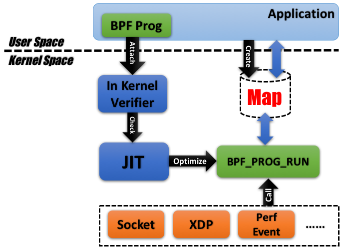
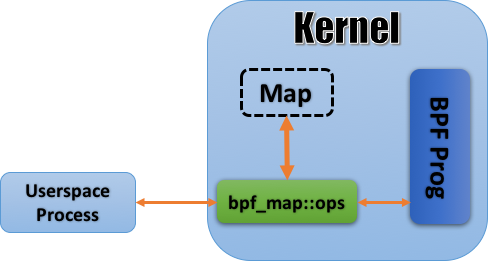

#### 来源

[张亦鸣](https://www.ibm.com/developerworks/cn/linux/l-lo-eBPF-history/index.html)

#### eBPF与BPF简介

eBPF源于BPF(Berkeley Packet Filter)。

BPF是一个过滤网络报文的架构，是网络监控领域的基石。BPF的设计最早可追溯到1992年的一篇论文：The BSD Packet Filter: A New Architecture for User-level Packet Capture。BPF的两大核心功能：过滤和复制。过滤是依据输入的规则过滤报文，复制是将符合条件的报文由内核空间复制到用户空间。BPF 采用的报文过滤设计的全称是 CFG(Computation Flow Graph)，顾名思义是将过滤器构筑于一套基于 if-else 的控制流(flow graph)之上。

LSF(Linux Socket Filter)是Linux下的BPF实现。传统的 BSD 开启 BPF 的方式主要是靠打开(open)/dev/bpfX 设备，之后利用 ioctl 来进行控制；而 linux 则选择了利用套接字选项(sockopt)SO_ATTACH_FILTER/SO_DETACH_FILTER 来执行系统调用.详见：`man socket`和内核文档Documentation/networking/filter.txt。内核中BPF的实现主要在net/core/filter.c下，有两个函数需要注意：sk_attach_filter(将 filter 伪代码由用户空间复制进内核空间)和sk_run_filter(在报文到来时执行伪码解析)。

BPF引入Linux之后，很长一段时间没有什么动静，直到3.0才开始引入JIT(Just-In-Time) Compiler。各平台的编译函数都实现于bpf_jit_compile函数中，如果 CONFIG_BPF_JIT 被打开，则传入的 BPF 伪代码就会被传入该函数加以编译，编译结果被拿来替换掉默认的处理函数 sk_run_filter()。JIT实现在arch/\<platform>/net之下。

内核版本到3.17的时候，实现了eBPF，在内核的kernel/bpf目录下。传统的BPF则被命名为cBPF(classical BPF)。eBPF带来的改变是革命性的：一方面，它已经为内核追踪(Kernel Tracing)、应用性能调优/监控、流控(Traffic Control)等领域带来了激动人心的变革；另一方面，在接口的设计以及易用性上，eBPF 也有了较大的改进。关于eBPF的用法详见samples/bpf/。

#### eBPF分析

##### 整体架构

##### BPF程序的类别

将 BPF 代码载入内核的函数是 bpf_load_program，通过 bpf_load_program 的参数 bpf_prog_type，我们可以看到 eBPF 支持的程序类型。

##### MAP机制

位于用户空间中的应用在内核中辟出一块空间建立起一个数据库用以和 eBPF 程序交互(bpf_create_map())；数据库本身以 Key-Value 的形式进行组织，无论是从用户空间还是内核空间都可以对其进行访问，两边有着相似的接口，最终在逻辑上也都殊途同归。

##### 指令集

 eBPF支持更多的寄存器，大量改动了cBPF的指令集。

##### In-kernel Verifier

eBPF可以看做是一种内核模块，在注入代码的时候有安全隐患，所以在载入程序bpf_load_program里加入了复杂的verifier机制。首轮检查check_cfg，进行深度优先搜索，主要是保证其中没有循环存在，并检查代码长度，非法jmp和不可达的指令。次轮检查do_check则检查的更细致。

#### 使用eBPF

用BCC(BPF Compiler Collection)进行BPF的开发。