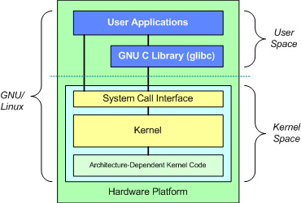

#### 获取帮助

1. Documentation目录：admin-guide/README.rst是基本的说明。00-INDEX说明了每个文件的内容。process/changes.rst说明了更新和编译内核的要求，更新内核时碰到的问题。
2. [Linux内核交互图](http://makelinux.net/kernel_map/)
3. [Linux内核剖析](https://www.ibm.com/developerworks/cn/linux/l-linux-kernel/)

#### 编译内核

##### 编译过程

	sudo make mrproper	//清除中间文件和配置文件
	sudo make menuconfig
	sudo make		//生成vmlinux内核文件，双核CPU可用-j4参数提高编译速度
	sudo make modules	//编译可加载模块
	sudo make modules_install	//将模块安装到标准模块目录中,位于/lib/modules中
	sudo make install	//安装内核,即将镜像文件和符号表文件放入/boot目录

##### 引导内核

	update-grub	//更新启动菜单
	在/etc/default/grub中确保GRUB_TIMEOUT非0
	在/etc/grub.d/30_os-prober中确保timeout值与GRUB_TIMEOUT的值一致

##### 问题记录

1. make menuconfig产生了一个fatal error,提示找不到curses.h，安装libncurses5-dev和libncursesw5-dev可解决此问题。

#### 逻辑结构

##### 系统调用接口(SCI)

kernel:不依赖于体系结构的部分。

arch:依赖于体系结构的部分。

##### 进程管理(PM)

创建：fork, exec 或 POSIX

停止：kill, exit

通信或同步：signal或POSIX

kernel:不依赖于体系结构的部分。

arch:依赖于体系结构的部分。

##### 内存管理(MM)

slab分配器。

虚拟内存管理。

mm：内存管理的源代码。

##### 虚拟文件系统(VFS)

fs:文件系统的代码。

##### 网络堆栈

net:网络源代码。

##### 设备驱动(DD)

drivers:设备驱动程序的代码。

##### 依赖体系结构的代码

arch目录

#### 文件结构

#### 运行过程

##### step1: ROM

BIOS

##### step2: bootloader

- first stage

  MBR

- second stage

  加载内核和initial RAM disk (initrd)。initrd是内存中的临时根文件系统，可以使内核不必挂载任何物理磁盘而完全启动。内核启动完成后，会卸载掉initrd而挂载上真正的根文件系统。

##### step3: Linux

`_start`是整个内核的入口(对于rsicv来说)，在arch/riscv/kernel/head.S。进行基本的硬件设置。

`start_kernel`是整个内核的主函数，在init/mian.c。初始化中断、内存，最后运行init函数(用户空间的第一个进程)。

- set_task_stack_end_magic(&init_task)函数定义在kernel/fork.c，它会找到栈的边界，然后在边界上设置溢出标志`STACK_END_MAGIC`。
- smp_setup_processor_id()函数定义在init/main.c，是个空函数。weak属性用于避免全局符号重名引发的重定义错误。当普通全局符号可用时忽略弱符号，但普通全局符号不可用时链接器则使用弱符号。当有多个CPU的时候它就返回在启动的时候的那个CPU的id。
- debug_objects_early_init()函数定义在include/linux/debugobjects.h，用于内核的对象调试。如果定义了`CONFIG_DEBUG_OBJECTS`则使用lib/debugobjects.c下的实现，否则它是一个空函数。它的具体实现是初始化了obj_hash、obj_static_pool这两个全局变量，以在调试的时候使用。
- boot_init_stack_canary()尽快设置最初的canary。
- cgroup_init_early()初始化cgroup所需要的参数。受参数`CONFIG_CGROUPS`控制，如果没有定义则为空函数，如果有定义则在kernel/cgroup/cgroup.c。
- local_irq_disable()关闭当前CPU的所有中断，中断要在系统初始化结束后再打开。
- boot_cpu_init()在kernel/cpu.c，用于激活第一个处理器。
- page_address_init()在当前定义为空，即定义了参数`WANT_PAGE_VIRTUAL`。但如果定义了`HASHED_PAGE_VIRTUAL`，则在文件mm/highmem.c中。
- setup_arch(&command_line)用于内存映像的初始化，参数command_line来自于bootloader。
- mm_init_cpumask(&init_mm)定义在include/linux/mm_types.h，初始化init_mm。
- setup_command_line(command_line)定义在init/main.c中，保存command_line以备将来使用。
- setup_nr_cpu_ids()设置变量nr_cpu_ids。
- setup_per_cpu_areas()设置每个CPU使用的内存空间，同时拷贝初始化段里的数据。
- boot_cpu_state_init()
- smp_prepare_boot_cpu()架构相关的启动CPU的钩子。
- build_all_zonelists(NULL, NULL)初始化所有内存管理节点列表，以便后面进行内存管理初始化。
- page_alloc_init()内存页初始化，设置页分配通知器。
- parse_early_param()解析需要早期处理的启动参数。
- parse_args()对传入内核的参数进行解释。
- jump_label_init()将静态跳转标志(static_key_initialized)定义为true。
- setup_log_buf(0)分配一个启动的log缓冲区。
- pidhash_init()初始化pid hash table。
- vfs_caches_init_early()虚拟文件系统的早期初始化。
- sort_main_extable()对内核exception table进行排序。
- trap_init()陷阱初始化。
- mm_init()初始化内核内存分配器，过度到伙伴系统，启动slab机制，初始化非连续内存区。
- sched_init()设置进程调度器。
- preempt_disable禁止抢占，因为早期的调度是极其脆弱的。
- idr_init_cache
- rcu_init初始化rcu机制，读写拷贝。
- trace_init跟踪事件初始化。
- context_tracking_init
- radix_tree_init：radix树算法初始化。
- early_irq_init早期中断初始化。
- init_IRQ架构相关中断初始化。
- tick_init初始化tick控制。
- rcu_init_nohz
- init_timers初始化时钟控制器。
- hrtimers_init初始化高精度时钟控制器。
- softirq_init初始化软件中断。
- timekeeping_init初始化系统时钟计时器。
- time_init初始化系统时钟。
- sched_clock_postinit对每个CPU进行系统进程调度时钟初始化。
- printk_nmi_init
- perf_event_init
- profile_init内核诊断工具profile初始化。
- call_function_init
- kmem_cache_init_late：slab分配器后期初始化。
- console_init()控制台初始化。从这个函数之后就可以输出内容到控制台了。在此之前的输出保存在输出缓冲区中，这个函数被调用之后就马上把之前的内容输出出来。
- lockdep_info打印锁依赖信息，进行自我检测
- locking_selftest锁自测
- page_ext_init
- debug_objects_mem_init创建调试对象内存缓存
- kmemleak_init内存泄漏检测机制的初始化
- setup_per_cpu_pageset为每个CPU分配页集合，并初始化
- numa_policy_init初始化NUMA的内存访问策略。提高多个CPU的内存访问速度。多个CPU访问同一个节点的内存速度比访问多个节点的内存速度大得多。
- sched_clock_init
- calibrate_delay主要计算CPU需要校准的时间
- pidmap_init初始化pid映射
- anon_vma_init初始化EFI的接口，并进入虚拟模式。
- acpi_early_initacpi早期初始化
- thread_stack_cache_init进程栈缓存初始化
- cred_init任务信用系统初始化
- fork_init根据当前物理内存计算出来可以创建进程（线程）的最大数量，并进行进程环境初始化，为task_struct分配空间。
- proc_caches_init进程缓存初始化
- buffer_init文件系统的缓存区初始化
- key_init初始化内核安全键管理列表和结构，内核秘钥管理系统
- security_init初始化内核安全管理框架，以便提供文件\登陆等权限
- dbg_late_init内核调试系统后期初始化
- vfs_caches_init虚拟文件系统进行缓存初始化，提高虚拟文件系统的访问速度。
- signals_init信号初始化
- page_writeback_init页回写初始化，rootfs填充可能用到
- proc_root_init初始化系统进程文件系统，主要提供内核与用户进行交互的平台，方便用户实时查看进程的信息。
- nsfs_init初始化nsfs
- cpuset_init初始化CPUSET。CPUSET主要为控制组提供CPU和内存节点的管理的结构。
- cgroup_init进程控制组正式初始化，主要用来为进程和它的子进程提供性能控制。
- taskstats_init_early任务状态早期初始化，为结构体获取高速缓存，并初始化互斥机制。
- delayacct_init任务延迟机制初始化，初始化每个任务延时计数。当一个任务等待CPU或者IO同步的时候，都需要计算等待时间。
- check_bugs检查CPU配置、FPU等是否非法使用不具备的功能，检查CPU BUG，软件规避BUG
- acpi_subsystem_init：acpi子系统初始化
- sfi_init_late：simple fireware interface 初始化
- ftrace_init功能跟踪调试机制初始化，初始化内核跟踪模块。ftrace的作用是帮助开发人员了解Linux内核的运行时行为，以便于进行故障调试或者性能分析。
- rest_init内核的其余初始化工作。这个函数的作用是避免主线程和init线程之间的竞争，防止主线程还没进行到`cpu_idle`的时候`start_kernel`就被`free_initmem`给释放掉了。

`rest_init`

`kernel_init`

`run_init_process`

##### step4: init进程

用户空间的第一个进程

