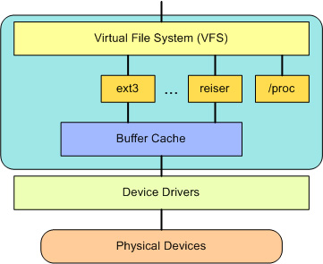

#### 获取帮助

1. Documentation目录：admin-guide/README.rst是基本的说明。00-INDEX说明了每个文件的内容。process/changes.rst说明了更新和编译内核的要求，更新内核时碰到的问题。
2. [Linux内核交互图](http://makelinux.net/kernel_map/)
3. [Linux内核剖析](https://www.ibm.com/developerworks/cn/linux/l-linux-kernel/)

### 逻辑结构

#### 系统调用接口(SCI)

#### 内核管理的核心代码

##### init:

##### kernel:

#### 进程管理(PM)

创建：fork, exec 或 POSIX

停止：kill, exit

通信或同步：signal或POSIX

#### 内存管理(MM)

slab分配器。

虚拟内存管理。

##### mm

内存管理的源代码。

#### 虚拟文件系统(VFS)

##### fs

文件系统的代码。

#### 网络协议栈

##### net

网络协议源代码。

#### 设备驱动(DD)

##### drivers

设备驱动程序的代码。

#### 依赖体系结构的代码

arch目录，存放与体系结构相关的代码。每个子目录对应具体的CPU，每个子目录下又有三个子目录：boot(系统引导) mm(存储管理) kernel(系统调用)。

##### arch/riscv

- kernel/setup.c

`setup_arch`：被外部的`start_kernel`(init/main.c)调用。设置内存与多处理器。

- kernel/traps.c

`trap_init`：被外部的`start_kernel`（init/main.c)调用。被内部的`smp_callin`(kernel/smpboot.c)调用。设置sscratch为0,告诉异常处理程序我们在内核中；为 stvec指定异常处理程序`handle_exception`(kernel/entry.S); 设置sie寄存器为-1使能所有的中断。

- kernel/smpboot.c

`setup_smp`:被setup_arch调用。设置多处理器。

- kernel/entry.S

`__switch_to`:通过被`switch_to`(asm/switch_to.h)封装的形式被外部的`context_switch` (kernel/sched/core.c)调用。

`SAVE_ALL`：宏，在进入系统调用或异常前将所有的寄存器保存在栈里。

`RESTORE_ALL`：宏，在从系统调用或异常返回前将栈中的值再保存到寄存器里。

`handle_exception`：入口，异常处理程序。

`ret_form_fork`：入口，从fork返回。

`ret_from_kernel_thread`：入口，从内核线程中返回。

`__fstate_save`：入口，文件状态保存。

`__fstate_restore`：入口，文件状态重新保存。

`excep_vect_table`：入口，异常向量表。

- kernel/head.S

`_start`：是整个内核的入口。

#### 内核的库代码

##### include

##### lib

