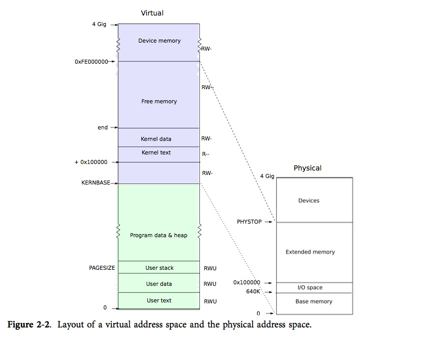
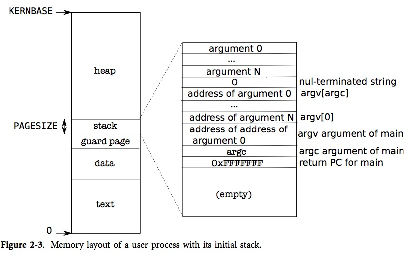

#### 1. 进程管理

- 进程控制块`struct proc`维护了进程的信息，**页表**信息描述了进程的内存分配情况，**内核栈**使进程可以在用户态和内核态间切换，**进程状态**使进程可以在不同状态间切换。
- `proc.c`的userinit函数创建了第一个进程。详见：第一章 第一个进程 **代码：创建第一个进程**。
- `proc.c`的sleep和wakeup是非常普通但有效的同步方法。`sleep`是将当前进程转化为`SLEEPING`状态并调用`sched`以释放CPU，`wakeup`是寻找一个睡眠状态的进程并把它标记为`RUNNABLE`。
- `proc.c`的wait,exit,kill的实现。详见：第五章 **代码:wait,exit,kill**
- `initcode.S`的作用是触发exec系统调用。详见：第一章 第一个进程 **第一个系统调用：exec**。
- `exec.c`的exec函数是创建地址空间中用户部分的系统调用。详见：第二章 页表 **代码：exec**。
- `elf.h`描述了xv6应用程序的格式。

#### 2. 物理内存管理

- `mmu.h`是对物理内存管理底层的定义，包括与页表相关的结构体。

- `entry.S`是内核入口，作用是建立C语言的执行环境。主要是建立页表映射和设置栈。详见： 第一章 第一个进程 **代码：第一个地址空间**。

- `vm.c`里的kvmalloc函数建立新的页表映射，并通过修改cr3寄存器转换到新的映射中。详见：第二章 页表 **代码：建立一个地址空间**。

- 内核地址空间到物理内存的映射

  

- 用户地址空间的结构

  

#### 3. 中断管理

- xv6	在启动主	cpu和其他cpu时屏蔽中断。然后由每个处理器的调度器打开中断。为了控制一些特殊的代码片段不被中断,xv6在进入这些代码片段之前关中断(例如switchuvm)。

- 中断的过程(用户模式从1开始。内核模式从2开始，且在第8步跳回的是内核空间。)

  1. 从任务段描述符中加载%esp和%ss，把老的%ss和%esp压入新的栈中。

  2. 把%eflags, %cs, %eip压栈。

  3. 对某些内陷，处理器会压入一个错误字。

  4. 处理器从IDT中加载新的%eip和%cs，跳转到某个中断例程。

  5. 大部分中断例程都是压入一个错误码(其实就是0)和中断号，然后跳转到alltraps。少部分中断例程不压入错误码，其错误码是由CPU压入的(8号，10～14号，17号)。

  6. alltraps在`trapasm.S`里，它是将`trapframe`结构体定义的剩余寄存器压入栈中，这个结构体包含了中断发生时处理器的状态。

     ```c
     struct trapframe {
       // registers as pushed by pusha
       uint edi;
       uint esi;
       uint ebp;
       uint oesp;      // useless & ignored
       uint ebx;
       uint edx;
       uint ecx;
       uint eax;

       // rest of trap frame
       ushort gs;
       ushort padding1;
       ushort fs;
       ushort padding2;
       ushort es;
       ushort padding3;
       ushort ds;
       ushort padding4;
       uint trapno;

       // below here defined by x86 hardware
       uint err;
       uint eip;
       ushort cs;
       ushort padding5;
       uint eflags;

       // below here only when crossing rings, such as from user to kernel
       uint esp;
       ushort ss;
       ushort padding6;
     };
     ```

  7. alltraps接着将%esp压栈作为`trap`的参数，调用`trap`函数处理中断，`trap`返回后，alltraps弹出栈上的参数，然后执行trapret的代码。

  8. trapret弹出中断桢以恢复用户模式下的寄存器，然后执行iret跳回用户空间。

- `traps.h`记录了所有确定的中断类型。


- `trap.c`的trap函数是中断的主控函数。它是依据中断号`tf->trapno`来判断自己被调用的原因以及自己该做些什么的。首先，它会判断调用原因是否是系统调用，如果是则调用系统调用处理程序`syscall`。然后，它会判断调用原因是否是硬件中断，如果是硬件中断则执行相应的中断函数。最后，如果它即不是系统调用也不是硬件中断，trap就认为它是一个异常。如果是内核错误，则打印错误细节并调用`panic`，如果是用户程序的错误，则打印错误细节并设置`myproc()->killed`使之在trap函数接下来的部分被清除掉。

  当因时钟中断而调用trap时, trap只完成两个任务:递增时钟变量的值,并且调用wakeup。

  ```c
    case T_IRQ0 + IRQ_TIMER:
      if(cpuid() == 0){
        acquire(&tickslock);
        ticks++;
        wakeup(&ticks);
        release(&tickslock);
      }
      lapiceoi();
      break;
  ```

  ​

- `syscall.c`的syscall函数用于处理系统调用。首先，它从中断桢中读出系统调用号，系统调用号保存在%eax中(详见`usys.S`)，是系统调用表(syscalls[])的索引。然后，当系统调用表中的系统调用返回时，它的返回值被保存在中断桢的%eax中，这样当系统调用返回用户空间时，这个返回值就从中断桢中加载到寄存器%eax中。

- `syscall.c`的argint, argptr和argstr用于获取第n个系统调用的参数，它们分别用于获得整数，指针和字符串起始地址。`argint`其实就是对`fetchint`的封装，`fetchint`的作用是把一个内存地址中的整型值保存到一个指针里。`argstr`其实是对`fetchstr`的封装，`fetchstr`的作用是字符串的首地址保存在指针里。

- `picirq.c`是早期主板的简单的可编程中断控制器(PIC)的管理代码。

- `ioapic.c`处理的是多处理器I/O系统中的中断，它维护了一个表(PRT,Programmable Redirection Table)，处理器通过MMIO读写这张表而实现中断管理。

- `lapic.c`是关联到每一个处理器上的中断。

- `buf.h`里的`struct buf`是磁盘驱动程序用来表示一个磁盘扇区的。

  ```c
  struct buf {
    int flags;		// 内存和磁盘的关系:B_VALID,数据已被读入。B_DIRTY，数据需要被写出。B_BUSY,一个锁，代表此缓冲区被某个进程锁住了。
    uint dev;			// 设备号
    uint blockno;		// 扇区号
    struct sleeplock lock;
    uint refcnt;
    struct buf *prev; // LRU cache list
    struct buf *next;
    struct buf *qnext; // disk queue
    uchar data[BSIZE];	// 该扇区数据在内存中的拷贝
  };
  ```

- `ide.c`是磁盘驱动。

  `iderw`函数根据标志位更新一个锁住的缓冲区，如果B_DIRTY被设置将缓冲区的内容写到磁盘，如果B_VALID没有被设置，从磁盘中读出数据到缓冲区。`iderw`维护了一个等待中的磁盘请求队列,然后用中断来指明哪一个请求已经完成。`iderw`将缓冲区`b`送到队列的末尾。如果这个缓冲区在队首, iderw通过`idestart`将它送到磁盘上;在其他情况下,一个缓冲区被开始处理当且仅当它前面的缓冲区被处理完毕。

  `idestart`依据标志位发出关于缓冲区所在设备和扇区的读或者写操作。如果操作是一个写操作, idestart必须提供数据而在写出到磁盘完成后会发出一个中断。如果操作是一个读操作,则发出一个代表数据就绪的中断,然后中断处理程序会读出数据。

  磁盘会完成自己的操作后会触发一个中断，trap会调用`ideintr`来处理它。`ideintr`查询队列中的第一个缓冲区,看正在发生什么操作。如果该缓冲区正在被读入并且磁盘控制器有数据在等待,`ideintr`就会调用insl将数据读入缓冲区。现在缓冲区已经就绪了: ideintr设置B_VALID,清除B_DIRTY,唤醒任何一个睡眠在这个缓冲区上的进程。最终, 	ideintr将下一个等待中的缓冲区传递给磁盘。

#### 4. 锁

- `spinlock.h`定义了锁的结构

  ```c
  /* 锁的数据结构 */
  struct spinlock {
    uint locked;       // 0:可以上锁，非0：已经上锁

    // For debugging:
    char *name;        // Name of lock.
    struct cpu *cpu;   // The cpu holding the lock.
    uint pcs[10];      // The call stack (an array of program counters)
                       // that locked the lock.
  };
  ```

- spinlock.c定义了锁的操作

  函数`acquire`用来获得锁。它使用原子指令`xchg`将`lk->locked`置1来上锁,为了便于调试还会记录获得锁的CPU和栈的信息。

  函数`release`用来释放锁。它清除调试信息，并将`lk->locked`置0.

#### 5. 调度

xv6的调度算法是轮转法(round robin)，仅仅是让每个进程轮流执行。每个CPU都有自己的调度线程，调度就发生在调度线程中。

- `swtch.S`是上下文切换的代码。存在两种类型的切换：内核线程和调度器线程之间的切换，用户进程和内核线程之间的切换。

  在`proc.h`里定义了上下文的结构`struct context`，它决定了上下文切换的次序。

  ```c
  struct context {
    uint edi;
    uint esi;
    uint ebx;
    uint ebp;
    uint eip;
  };
  ```

  首先用%eax保存`struct context **old`的指针，%edx保存`struct context *new`的值，然后依次将%ebp, %ebx, %esi, %edi入栈，然后将当前%esp保存在`*old`中，将%esp切换到`new`，最后将之前保存的寄存器的值出栈并返回。

  xv6调用`swtch`函数的地方只有两处：一处是是在`proc.c`的`sched`函数里，从内核线程切换到某个CPU的调度器线程；一处是在`proc.c`的`scheduler`函数里，从某个CPU的调度器线程切换到内核线程。

- `proc.c`里的调度部分，共行程序sched和scheduler。

  进程释放CPU的过程：获得进程表的锁`ptable.lock`，释放拥有的其它锁，修改自己的状态`proc->state`，调用`sched`。`yield`, `sleep`和`exit`都遵循了这个约定。

  `sched`首先检查进程此时是否持有锁，CPU是否关闭了中断。然后调用swtch切换到调度器上下文 ，返回到`mycpu()->scheduler`中。

  `scheduler`则是一个双层for循环。在内层循环中找到一个可运行的进程(p->state==RUNNABLE)，然后将当前cpu的`c->proc`设为该进程，用`switchuvm`切换到该进程的页表，标记该进程为`RUNNING`，再调用`swtch`切换到该进程中运行。在外层循环中要释放锁并显式地允许中断。因为如果一个闲置的调度器如果一直持有锁，其它CPU就不能进行调度操作了，如果不允许中断其它进程的I/O就永远无法到达了。

#### 6. 文件系统

xv6的文件系统分6层，如下表所示。

| 表现形式 | 实现形式     | 作用                                     |
| -------- | ------------ | ---------------------------------------- |
| 系统调用 | 文件描述符   | 将管道，设备，文件等抽象为文件系统的接口 |
| 路径名   | 递归查找     | 实现了文件的路径                         |
| 目录     | 目录结点     | 由目录项组成的结点                       |
| 文件     | 结点和数据块 | 由结点和数据块组成的文件                 |
| 事务     | 会话         | 通过会话的方式保证磁盘操作的原子性       |
| 块       | 缓存         | 对硬盘的缓存                             |

硬盘上文件系统的结构如下表所示，可与`fs.h`对照阅读。

| 块号   | 存放内容 | 作用                           |
| ------ | -------- | ------------------------------ |
| 最后   | log      | 日志块，是会话层的一部分       |
| 大部分 | data     | 数据块，保存了文件和目录的内容 |
|        | bit map  | 空闲块位图                     |
| 2      | inodes   | 存放结点                       |
| 1      | super    | 超级块，存放文件系统元信息     |
| 0      | boot     | 存放bootloader，文件系统不用   |

- `bio.c`是块缓冲层的代码，使用的是近期最少使用算法(LRU)。详见：第六章 **代码:块缓冲**
- `log.c`是日志层的代码。详见：第六章 **代码:日志**
- `fs.c`的balloc和bfree函数。详见：第六章 **代码:块分配器**
- `fs.c`中对i结点的操作。详见：第六章 **代码:i节点**
- `fs.c`中bmap函数。详见：第六章 **代码:i节点内容**
- `fs.c`中目录层的代码。详见：第六章 **代码:目录层**
- `fs.c`中路径名的操作。详见：第六章 **代码:路径名**
- `file.c`是文件描述符层的代码。详见：第六章 **文件描述符层**
- `sysfile.c`是对文件系统的系统调用。详见：第六章 **代码:系统调用**


- `pipe.c`是管道的代码。详见：第五章 **代码:管道**

#### 参考资料

- [xv6 for x86源码](https://github.com/mit-pdos/xv6-public.git)
- [xv6 for riscv源码](git://github.com/mit-pdos/xv6-riscv.git)
- [xv6中文文档](https://www.gitbook.io/book/th0ar/xv6-chinese)