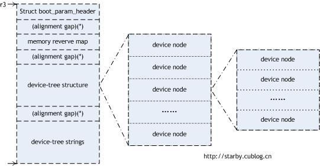

### 简介

bbl: Berkeley Boot Loader，但我认为它没有完成一个boot loader的功能，它只是把普通意义上的内核再打包成了一个新内核，主要还是为操作系统提供了一组调用接口(SBI)。源代码地址：[https://github.com/riscv/riscv-pk](https://github.com/riscv/riscv-pk)

fdt : Flattened Device Tree(扁平设备树) ，是一个描述系统中硬件的数据结构。操作系统使用fdt来查找和注册系统中的设备。它可以描述的硬件包括：CPU的数量与种类，内存的基址与大小，总线与桥，外围设备的连接，中断控制器与IRQ线的连接。它是对硬件的一个封装，减少内核对硬件的依赖，降低内核在设计和编译上的要求。U-Boot和Linux均使用了扁平设备树这样的动态接口。可以参考：[官方资料](http://www.devicetree.org/Main_Page)，[Linux内核文档](https://git.kernel.org/cgit/linux/kernel/git/torvalds/linux.git/tree/Documentation/devicetree)，[Linuxidc targethero](https://www.linuxidc.com/Linux/2016-01/127337.htm)

htif : Host/Target Interface，是ARM PS与RISC-V系统之间的的接口，它采用FIFO的通信方式。它在CSR空间中提供了两个通信寄存器(fromhost, tohost)来实现此目的。host(即ARM PS)可以通过htif来加载二进制文件，访问内存和CSR，并且为外围设备仿真提供系统调用。

16550uart：uart芯片的一种型号，由美国国家半导体公司生产，并产生了许多变体，包括 16C550, 16C650, 16C750, 和16C850.

ipi :  interprocessor interrupts(处理器间中断)。

hls： hart-local storage, at top of stack

plic： Platform Level Interrupt Controller，可参考：[PLIC](https://content.riscv.org/wp-content/uploads/2017/12/Tue1642_PLIC_Richard_Herveille.pdf)

clint： Core Local Interrupter，提供实时时钟，计时器和处理器间中断。

### 文件结构

#### 编译过程

1. 将`bbl`文件夹下的`logo.c`,`payload.S`,`raw_logo.S`编译为库`libbbl.a`
2. 将`machine`文件夹下的`fdt.c`, `mtrap.c`, `minit.c`, `htif.c`, `emulation.c`, `muldiv_emulation.c`,` fp_emulation.c`, `fp_ldst.c`, `uart.c`, `finisher.c`, `misaligned_ldst.c`, `mentry.S`, `fp_asm.S`编译为库`libmachine.a`
3. 将`util`目录下的`snprintf.c`, `string.c`,编译为`libutil.a`
4. 使用以上库将`bbl`目录下的`bbl.c`编译为`bbl.o`
5. 依据`bbl.lds`将`bbl.o`编译为`bbl`，内核也是在此时加到`bbl`里的

#### mentry.S文件

- trap_table：
- reset_vector：
- trap_vector：

### 逻辑结构

#### 1. fdt的管理

详见`machine/fdt.c`和`machine/fdt.h`

FDT主要由三大部分组成：Header, Structure block, Strings block。在内存中的分配如下图所示：



```c
/* Header主要描述设备树的基本信息 */
struct fdt_header {
  uint32_t magic;			// 魔数，固定为0xd00dfeed
  uint32_t totalsize;		// 整个设备树的大小
  uint32_t off_dt_struct;	// Structure block的偏移地址
  uint32_t off_dt_strings;	// Strings block的偏移地址
  uint32_t off_mem_rsvmap;	// 内存保留区的偏移地址，该区不能被内核动态分配
  uint32_t version;			// 设备树版本
  uint32_t last_comp_version; // 向下兼容版本号
  uint32_t boot_cpuid_phys;		// 多处理器中用于启动的物理CPU的ID
  uint32_t size_dt_strings;		// Strings block的大小
  uint32_t size_dt_struct;		// Structure block的大小
};
/* Structure block以节点的形式保存目标板的设备信息，节点之间是树形结构，是设备树的主体 */
#define FDT_BEGIN_NODE	1	// 一个node的开始位置
#define FDT_END_NODE	2	// 一个node的结束位置
#define FDT_PROP	3		// 一个property的开始位置
#define FDT_NOP		4		// 空节点
#define FDT_END		9		// Structure block的结束位置
// 节点信息
struct fdt_scan_node {
  const struct fdt_scan_node *parent;	// 父节点的指针(树形结构)
  const char *name;		// 节点名
  int address_cells;	// 总线地址需要几个cell(32bits为1个cell)，默认为2
  int size_cells;		// 子总线地址需要几个cell，默认为1
};
// 节点属性
struct fdt_scan_prop {
  const struct fdt_scan_node *node;// 节点指针
  const char *name;	// 属性名
  uint32_t *value;	// 属性值
  int len; // 属性值的长度，以字节为单位
};
// 一个node的结构如下
- 节点开始标志：FDT_BEGIN_NODE
- 节点路径或节点单元名(version<3:节点路径，version>=16：节点单元名)
- 填充字段(对齐到4字节)
- 节点属性：FDT_PROP+属性值的字节长度(4Byte)+属性名的偏移地址(4Byte)+属性值和填充(对齐到4字节)
- 如果存在子节点，则定义之。
- 节点结构标志：FDT_END
/* Strings block存放的是属性名，字符串块的引入避免了重复存储冗余的属性名，它的目的就是为了节省存储空间 */
```

- 从`mentry.S`的`trap_vector`可见，`init_first_hart`函数的第0个和第1个参数是来自于之前的启动阶段，第2个参数是页偏移量12,第3个参数是uart号0。
- 从`minit.c`的`init_first_hart`函数来看，它的第0个参数是hartid(然而并没有用到)，第1个参数是dtb(二进制形式的设备树信息，其格式通常是参考fdt)。
- `struct fdt_cb`是一套fdt控制的框架，包含5种操作：open, prop, done, close, extra。
- `fdt_scan(fdt, cb)`是对`fdt_scan_helper`的封装，作用是描述FDT中的内容。
- `fdt_scan_helper(lex, strings, node, cb)`遍历FDT中的节点，并为相应的数据结构赋值。
- `fdt_size`函数的作用是获取FDT的大小。即`fdt_header->totalsize`。
- `bswap`是把字节顺序ABCD改为DCBA。
- `fdt_get_address(node, value, result)`：提取地址字段，存储在result里。
- `fdt_get_size`：提取大小字段。
- `fdt_string_list_index`：提取字符串的索引号。
- `query_mem`函数：设置内存。
- `query_harts`函数：设置硬件线程。
- `query_plic`函数：设置中断控制器。
- `query_clint`函数：设置内核本地中断。
- `filter_harts`函数：移除FDT中的harts信息。
- `filter_plic`函数：移除FDT中的中断控制器信息。
- `filter_compat`函数：移除FDT中的兼容性信息。

#### 2. 串口管理

```c
struct uart_scan{
  int compat;	// 1兼容sifive,0不兼容sifive
  uint64_t reg;	// 用来表示节点的地址资源，一般高32位是基址，低32位是大小
};
```

`query_uart`：依据fdt的内容修改`struct uart_scan`的值。

- `uart_open(node, extra)`:初始化extra指向的内存空间(cb.extra是`struct uart_scan`的指针)。
- `uart_prop(prop, extra)`：若属性名为"compatible"且属性值为"sifive,uart0"，则将scan->compat设为1。若属性名为"reg"，则将地址存储在scan->reg里。
- `uart_done`：设置scan->reg，使能Tx/Rx两个引脚。

```c
struct uart16550_scan
{
  int compat;
  uint64_t reg;
};
```

`query_uart16550`：依据fdt的内容修改`struct uart16550_scan`的值。

- `uart16550_open`
- `uart16550_prop`
- `uart16550_done`

#### 3. 电源按钮管理 

详见：`machine/finisher.c`

```c
struct finisher_scan
{
  int compat;
  uint64_t reg;
};
```

`query_finisher`：找到电源按钮，这样poweroff函数就可以工作了。

- `finisher_open`
- `finisher_prop`
- `finisher_done`

#### 4. 内存管理

详见：`machine/fdt.c`

```c
struct mem_scan {
  int memory;
  const uint32_t *reg_value;
  int reg_len;
};
```

`query_mem`函数：设置内存。

- `mem_open`
- `mem_prop`
- `mem_done`

#### 5. 中断管理

详见：`machine/fdt.c`，`machine/minit.c`

```c
struct plic_scan
{
  int compat;
  uint64_t reg;
  uint32_t *int_value;
  int int_len;
  int done;
  int ndev;
};
```

`query_plic`：设置中断控制器。

- `plic_open`
- `plic_prop`
- `plic_done`

`plic_init`：将plic_priorities[i]设置为1.

`hart_plic_init`：使能当前hart的中断。

#### 6. 处理器管理

详见：`machine/htif.c`，`machine/fdt.c`，`machine/minit.c`

```c
struct htif_scan
{
  int compat;
};
```

`query_htif`：依据FDT的值修改`struct htif_scan`的值。

- `htif_open`
- `htif_prop`
- `htif_done`

`hart_init`：设置mstatus, 浮点寄存器，机器自陷授权寄存器。初始化当前的硬件线程。

`hls_init`：初始化本地hart存储的结构体(`struct hls_t`)。

```c
struct hart_scan {
  const struct fdt_scan_node *cpu;
  int hart;
  const struct fdt_scan_node *controller;
  int cells;
  uint32_t phandle;
};
```

`query_harts`:设置硬件线程。

- `hart_open`
- `hart_prop`
- `hart_done`
- `hart_close`

`wake_harts`:唤醒所有harts的IPI。

### 运行过程

#### reset_vector

- 跳转到do_reset

#### do_reset

1. 初始化通用寄存器为0
2. 由于在机器态，设置mscratch寄存器为0
3. 设置mtvec寄存器，即trap_vector指针的值
4. 设置sp寄存器，即设置栈的位置
5. 依据mhartid寄存器的值设置sp寄存器
6. 如果mhartid值为0，则跳转到init_first_hart
7. 如果mhartid值不为0，则跳转到init_other_hart

#### init_first_hart

1. query_uart：获取uart的信息。
2. query_uart16550：获取uart16550的信息。
3. query_htif：获取htif的信息。
4. hart_init：初始化当前的硬件线程。
5. hls_init：初始化本地hart存储的结构体(`struct hls_t`)。
6. query_finisher：找到电源按钮，这样poweroff函数就可以工作了。
7. query_mem：获取内存的信息。
8. query_harts：获取harts的信息。
9. query_clint：设置内核本地中断。
10. query_plic：设置中断控制器。
11. wake_harts：唤醒所有的硬件线程
12. plic_init：初始化中断控制器
13. hart_plic_init：初始化硬件线程的中断控制器 
14. memory_init：初始化内存大小
15. boot_loader：调用`bbl/bbl.c`里的boot_loader函数

#### boot_loader

指定内核入口`_payload_start`，然后跳转到`boot_other_hart`。

#### boot_other_hart

跳转到`entry_supervisor_mode`。

#### entry_supervisor_mode

进入S-mode的原理。

### SBI函数

源代码详见：`machine/mtrap.c`和`machine/mcall.h`

`mcall_trap`<-`trap_table`<-`.Lhandle_trap_in_machine_mode`<-`trap_vector`<-`do_reset`

#### sbi_console_putchar

输入字符c，在控制台打印出此字符，无返回。

#### sbi_console_getchar

无输入，返回从控制台获取的字符。

#### sbi_set_timer

输入64位无符号整型(unsigned long long)，设置计时器，无返回。

#### sbi_send_ipi

IPI类型为IPI_SOFT，向所有处理器发送IPI中断。

#### sbi_remote_fence_i

IPI类型为IPI_FENCE_I，向所有处理器发送IPI中断。

#### sbi_remote_sfence_vma

IPI类型为IPI_SFENCE_VMA，向所有处理器发送IPI中断。

#### sbi_remote_sfence_vma_asid

与`sbi_remote_sfence_vma`无差别，只是多输入个参数asid。

#### sbi_clear_ipi

无输入，无输出。清除处理器间中断。

#### sbi_shutdown

关机